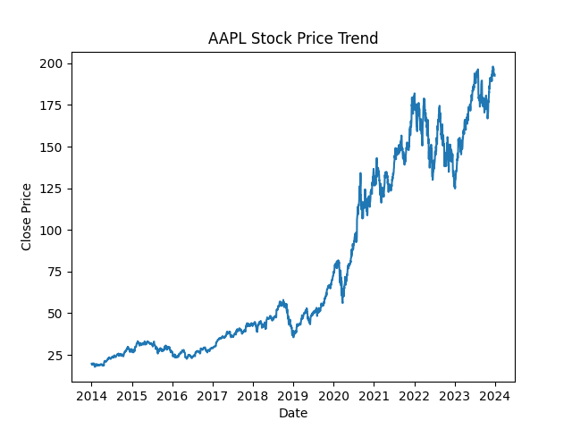
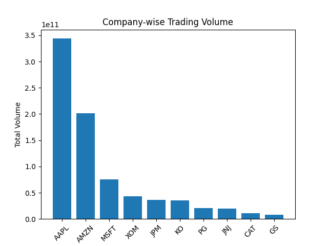
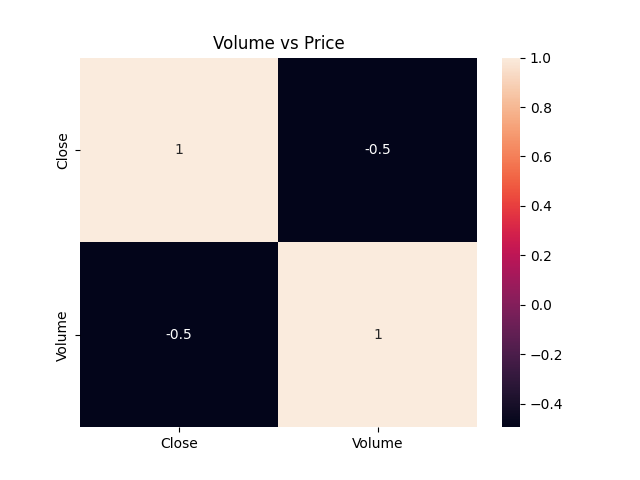

# 📊 Stock Price Analysis Project

This project performs **data analysis, visualization, statistical testing, and machine learning** on stock market data.

---

## 🔍 Objectives
- Analyze trading volume
- Identify stock price trends
- Perform monthly analysis
- Measure volatility
- Correlation analysis
- Outlier detection
- Hypothesis testing (T-test)
- Stock price prediction using ML

---

## 📁 Dataset
Stock data includes:
- Open, High, Low, Close prices
- Volume
- Date
- Company ticker

---

## 📊 Visualizations

### Price Trend


### Volume Analysis


### Correlation Heatmap


---

## 🤖 Machine Learning Model
- Model: Linear Regression
- Predicts closing price

### Performance:
- R² Score: Add your value
- MAE: Add your value
- RMSE: Add your value

---

## 📌 Conclusion
The project successfully analyzes stock trends and builds a prediction model using machine learning.

---

## 🚀 How to Run
```bash
pip install pandas numpy matplotlib seaborn scikit-learn
python stock_project.py
